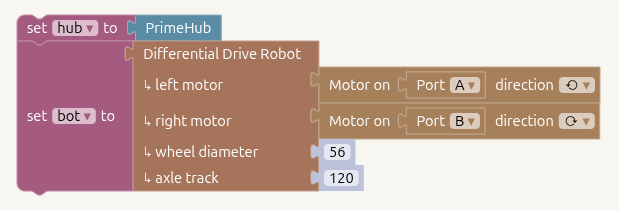

# µNotebook
An Juypter Notebook like tool for Pybricks and other Micropython devices.

<a class="button-link" href="//unotebook.org/code">Start Coding</a>

## About
This started as a way for my kid to program an ESP32-based robot we built.  I've since
added support for [Pybricks](https://pybricks.com/) (since he joined [FLL](https://www.firstlegoleague.org/)).

It supports notebook-style programming in a *mixture* of Python and visual block-style cells.

It connects to Pybrick devices (like the [Spike Prime Hub](https://education.lego.com/en-us/products/lego-technic-large-hub-for-spike-prime-/45601/)
and [Mindstorms Inventor Hub](https://www.lego.com/en-lt/product/large-hub-88016)) via Bluetooth and [Micropython](https://micropython.org/) devices
via [WebREPL](https://docs.micropython.org/en/latest/esp32/quickref.html#webrepl-web-browser-interactive-prompt).

## Why Notebook-Style Programming for Robotics?

Notebook-style programs are ideal for robotics because they blend code, data, and documentation in one place.

They enable:
- Interactive experimentation — run small code cells to move motors, read sensors, or tune parameters without reflashing.
- Fast iteration — adjust control or perception algorithms and instantly see results.
- Integrated visualization — plot trajectories, sensor data, or camera frames inline.
- Reproducibility and sharing — every experiment records its code, output, and notes together.
- Bridging simulation and hardware — the same notebook can command real robots or virtual ones.

This workflow shortens the test-observe-refine loop that defines robotics development.

## Why Mix Python and Block Coding?

Our notebook lets students mix block-based and Python code in the same workspace.

This makes it ideal for learning — beginners can start visually, then see and edit the exact Python code that’s generated.

It bridges the gap between drag-and-drop logic and real programming, helping students gradually build confidence and understanding without switching tools.

A block example:



Generated this code:

```python
from pybricks.hubs import PrimeHub
from pybricks.robotics import DriveBase
from pybricks.pupdevices import Motor
from pybricks.parameters import Port
from pybricks.parameters import Direction
hub = PrimeHub()
bot = DriveBase(
  Motor(Port.A, positive_direction=Direction.COUNTERCLOCKWISE),
  Motor(Port.B, positive_direction=Direction.CLOCKWISE),
  56, 120
)
```

## Examples
Check out some examples [here](https://github.com/keredson/unotebook/tree/main/examples).
